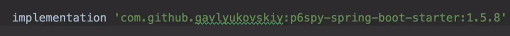

### 왜 QueryDSL을 쓰는가 ?
- 쿼리를 자바코드로 작성
    - 문법 오류를 컴파일타임에 검증
- 동적쿼리 문제 해결
- SQL 스타일 문법

> QueryDSL 은 JPA에 특화된 라이브러리가 아니다.
> JDO ? Lucene 등 여러가지 등에 대해 비슷한 사용자경험을 제공하고자 하는 것이 목적

- `spring.jpa.properties.hibernate.use_sql_comments: true`
- JPQL을 보고싶은 경우에 설정

### 페이지네이션 관련 문제
- query 에서 fetchResults(), 혹은 fetchCount() 는 Deprecated 되었다는 경고를 알려준다.
-  왜 deprecated 되었는가 ?
- count 절에 간단한 쿼리는 괜찮지만, 복잡한 쿼리가 들어가는 순간 문제가 된다.
  기본적으로 JPQL 에서 정상적으로 지원하지 않을 뿐더러, 일부 SQL 방언에서는 올바르게 동작하지 않는다.
  따라서, Blaze-Persistence를 사용하거나, 별도의 count 쿼리를 넘겨주는 방식으로 진행한다. (이 부분은 추후 수정 필요)

### Join의 On 절의 활용법
- 조인 대상 필터링
- 연관관계 없는 엔티티 외부 조인

### 서브쿼리의 한계
- from 절에서 사용할 수 없다.
- 해결방안
  1. 서브쿼리를 join으로 변경한다.(불가능한 경우도 있다.)
  2. 애플리케이션에서 쿼리를 2번 분리해서 실행한다.
  3. nativeSQL을 사용한다.
- SQL 에 모든 로직을 넣다보면, 위와 같은 문제점을 마주한다.
- 가능하면, 데이터를 가져오는 로직으로만 사용하자.

## Appendix

### TIPS
- 
- 로그에 파라미터 바인딩을 시켜주는 라이브러리
